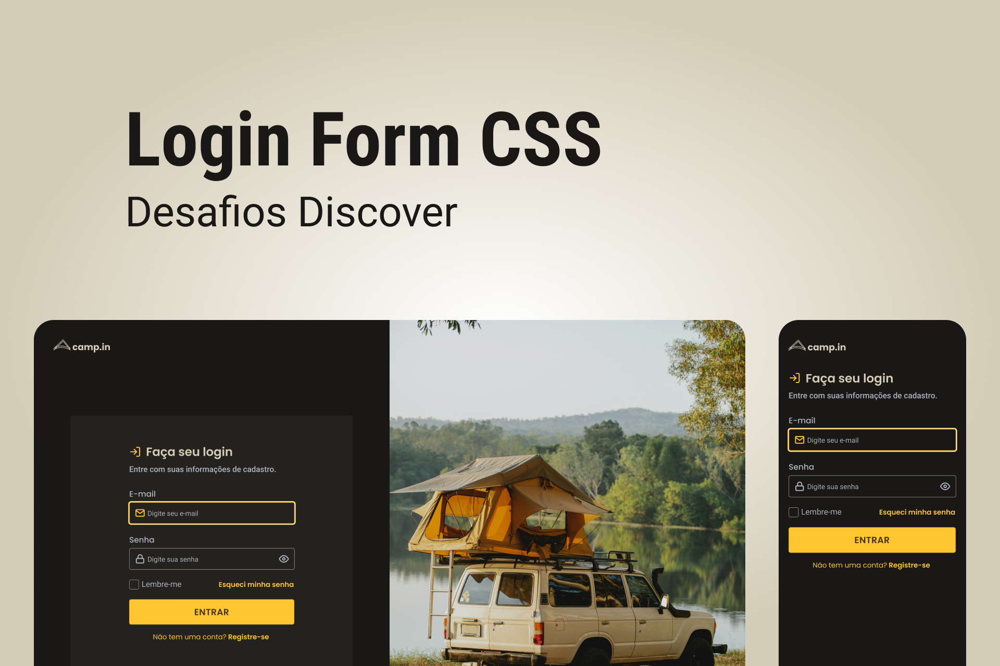
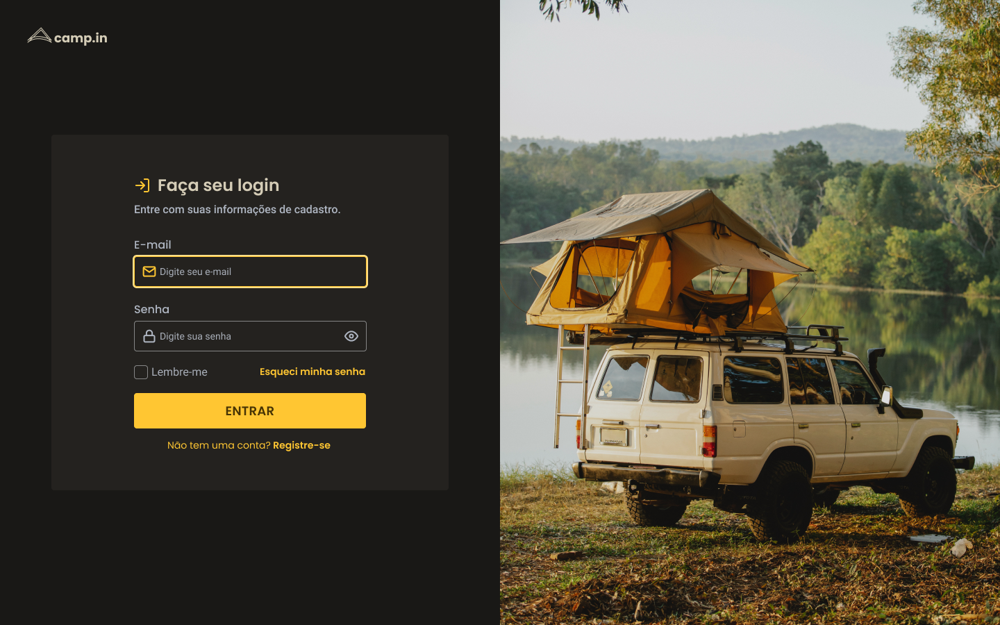
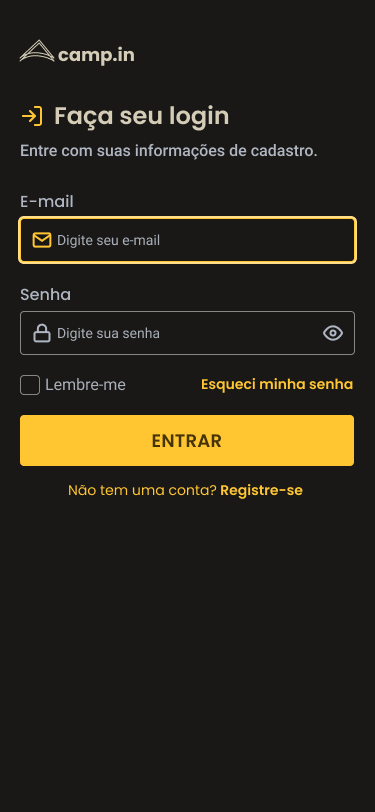

# Preview

  

      
  

# Desktop

  

      
  

# Mobile

  

      
  

  

Neste desafio você vai criar um formulário de login.

# Instruções

Para visualizar as intruções do desafio,[ acesse a página do Discover e bora codar! 🚀](https://efficient-sloth-d85.notion.site/Desafio-Login-Form-CSS-a10caea5a183494e97eb9ce4f33536b3)
