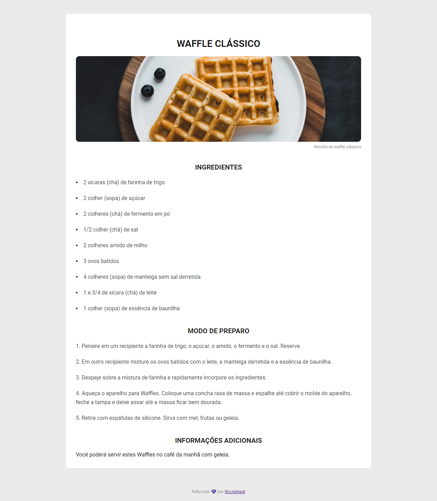

    

Nesse desafio você deverá criar uma página web de uma receita com título, imagem, lista de ingredientes e modo de preparo.

# Instruções

Para visualizar as intruções do desafio,[ acesse a página do Discover e bora codar! 🚀](https://efficient-sloth-d85.notion.site/Desafio-Piloto-P-gina-de-Receita-15acc6a34f744484a2e64a1f115bfbae)
