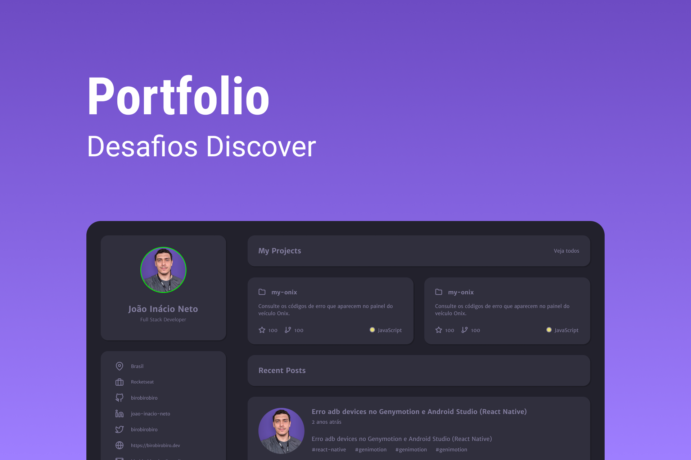

    

  Nesse desafio você irá desenvolver uma página para o seu portfolio pessoal

# Instruções

Desenvolva uma página que exiba o seu portfolio pessoal.

Para visualizar as intruções do desafio,[ acesse a página do Discover e bora codar! 🚀](https://efficient-sloth-d85.notion.site/Desafio-Portfolio-1d3db21e654941f5872aece5fcc6bcc6)
