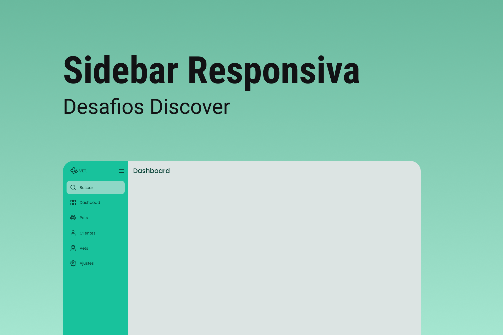

    

Neste desafio você deve criar uma sidebar como na imagem acima. Quando o usuário clicar no ícone do menu isso deve fazer com que o estado da sidebar mude entre "aberto", mostrando ícones e texto e "fechado", mostrando apenas os ícones.

# Instruções

Para visualizar as intruções do desafio,[ acesse a página do Discover e bora codar! 🚀](https://efficient-sloth-d85.notion.site/Desafio-Sidebar-f2251eb4976941eb958326ea327ffeb9)
