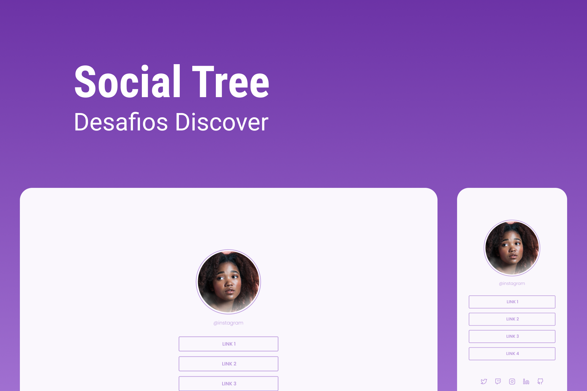

    

Neste desafio você deve criar uma página com uma lista de links que pode ser usada em perfis de redes sociais.

# Instruções

Para visualizar as intruções do desafio,[ acesse este link e bora codar! 🚀](https://efficient-sloth-d85.notion.site/Desafio-Social-Tree-a4008e467a3248c4b05c97cf78aea44f)
