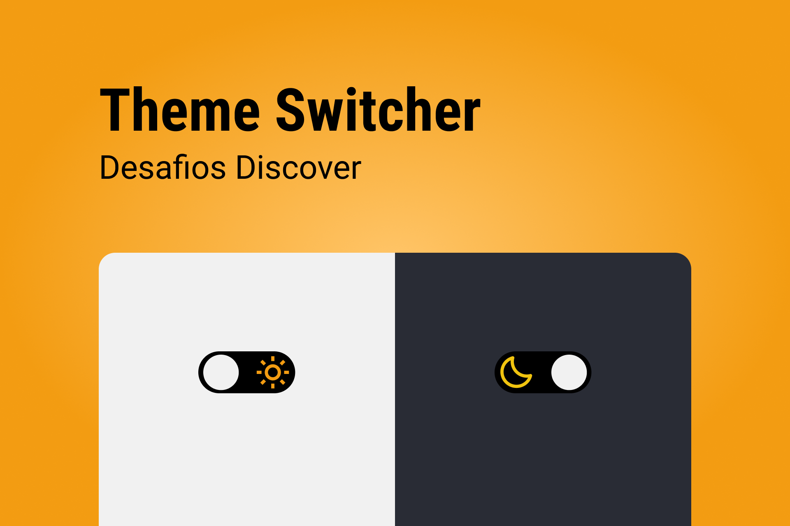

    

Nesse desafio você deverá desenvolver uma página que contenha um toggle para alternar entre o tema light e dark.

# Instruções

Nesse desafio você deverá desenvolver uma página que contenha um toggle para alternar entre o tema light e dark.

Para visualizar as intruções do desafio,[ acesse a página do Discover e bora codar! 🚀](https://efficient-sloth-d85.notion.site/Desafio-Theme-Switcher-dbabdf77f70d43298df382c8e805fc13)
