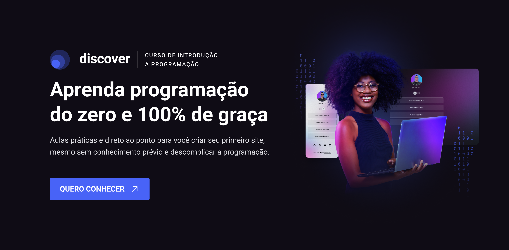

# Desafios Discover

Caiu de paraquedas aqui? <a target="_blank" href="https://rocketseat.com.br/discover">Conheça o Discover</a>

  

  

  
    
   
 

Faaala, dev!

**A gente sempre vai repetir: você precisa praticar, praticar e praticar!**

Esse é um dos pilares da metodologia aqui na Rocketseat: a prática é essencial para você desenvolver sua confiança, fazer seu portfolio crescer e decolar sua carreira como dev.

Então, aqui está um repositório com diversos desafios em vários níveis de dificuldade diferentes, para você pôr a mão na massa e desafiar a si mesmo.

**SE LIGA, DEV!**

🌟Cada desafio foi codado com muito **💜** pelo nosso time, mas não se preocupe se o seu código estiver diferente do exemplo. Essa é a magia da programação: existem muitos caminhos diferentes que levam aos mesmos resultados e criar soluções criativas é uma habilidade de sucesso!

🌟É normal não saber a resposta de cara. Aproveite o ambiente de estudo para pesquisar nas documentações e ferramentas da internet.

Ainda ficou com dúvida? **[Que tal pedir ajuda da comunidade?](https://discord.gg/rocketseat)**

🌟Os projetos foram desenvolvidos nas linguagens estipuladas, MAS você pode usar as ferramentas e tecnologias que prefere e, inclusive, ir além e criar novos projetos baseados nestes aqui (a famosa _milha extra_). Use sua criatividade para melhorar seus skills ou ainda explorar novas techs!

# Desafios

### Básico:

_Desafios indicados para quem está nos primeiros estágios do aprendizado. Projetos em HTML e CSS._

| Nome                                              | Tecnologia Sugerida |
| ------------------------------------------------- | ------------------- |
| [Desafios HTML](/Desafios/desafios-html/)         | HTML                |
| [Página de Receita](/Desafios/pagina-de-receita/) | HTML, CSS           |
| [Social Tree](/Desafios/social-tree/)             | HTML, CSS           |
| [Portfolio](/Desafios/portfolio/)                 | HTML, CSS           |
| [RocketNews](/Desafios/rocketnews/)               | HTML, CSS           |

### Intermediário:

_Projetos que desafiam devs já acostumados ao HTML e CSS, em início de aprendizado em JavaScript._

| Nome                                        | Tecnologia Sugerida |
| ------------------------------------------- | ------------------- |
| [RocketCoffee](/Desafios/rocket-coffee/)    | HTML, CSS           |
| [Login Form CSS](/Desafios/login-form-css/) | HTML, CSS           |
| [Pricing Table](/Desafios/pricing-table/)   | HTML, CSS           |
| [RocketBlog](/Desafios/rocket-blog/)        | HTML, CSS           |
| [RocketShoes](/Desafios/rocketshoes/)       | HTML, CSS           |
| [Sidebar](/Desafios/sidebar/)               | HTML, CSS, JS       |
| [Theme Switcher](/Desafios/theme-switcher/) | HTML, CSS, JS       |

### Avançado:

_Desafios desenvolvidos para quem deseja mergulhar mais fundo no universo das APIs e dev tools. Indicados para todos que codam facilmente em HTML, CSS e JavaScript._

| Nome                                 | Tecnologia Sugerida |
| ------------------------------------ | ------------------- |
| [RocketNFTs](/Desafios/rocket-nfts/) | HTML, CSS           |
| [Rocketcard](/Desafios/rocketcard/)  | HTML, CSS, JS       |
| [Countdown](/Desafios/countdown/)    | HTML, CSS, JS       |
| [Rocketflix](/Desafios/rocketflix/)  | HTML, CSS, JS       |

---

   

